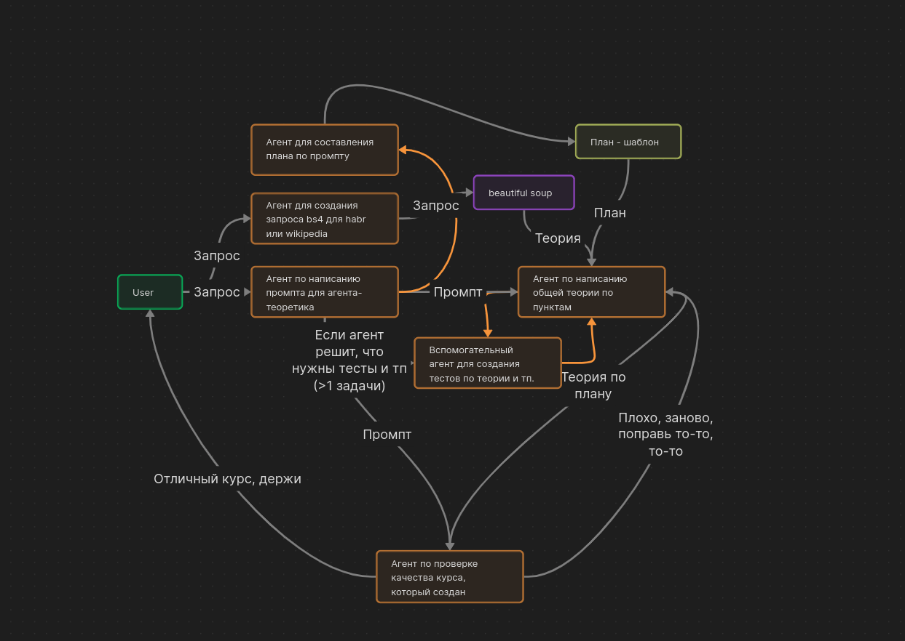
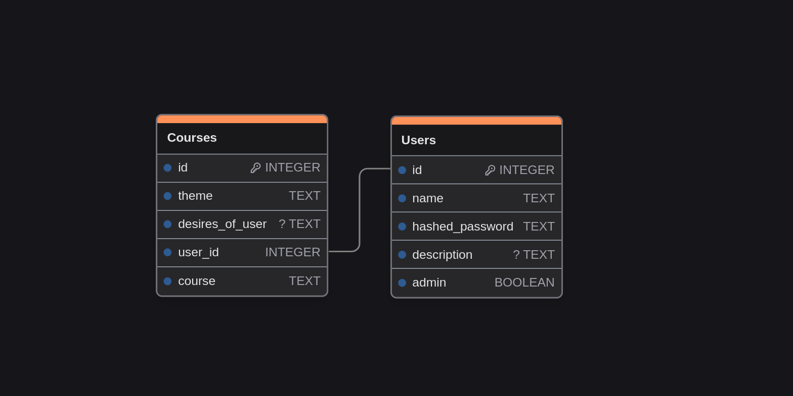

# Kairos -

Простой проект для создания индивидуального плана обучения с помощью ИИ. Упор идет на то, что данные будут парситься из СТАТЕЙ.(Это прописано в большинстве промптов)

## Required credentials

### 1. Google Custom Search API

Начнем с поиска данных в интернете. Для работы поиска нам понадобится CSE id и Google Search API Key. [Инструкция](https://developers.google.com/custom-search/v1/overview?hl=ru) по получению. При создании API ключа стоит учитывать, что вы можете указать список сайтов, которые будут парситься при API, что делает поиск более конкретным, узконаправленным и специфичным. Создать поисковый сервис в Google [тут](https://programmablesearchengine.google.com/controlpanel/all).

### 2. Mistral AI API

Теперь, главная составляющая проекта - ИИ. Получить API ключ можно на официальном [сайте Mistral](https://console.mistral.ai/api-keys/).

## Пример .env-файла

.env-файл должен лежать в корне проекта.

```.env
MISTRAL_AI_API_KEY=your-data
GOOGLE_API_KEY=your-data
CSE_ID=your-data
SECRET_KEY=your-data # Секретный ключ для корректной работы форм wtforms
```

## Интересные факты

### 0. [app.config](./app/config.py)

Файл конфига. В нем хранятся настройки проекта, которые можно менять и Вам, в зависимости от Ваших нужд.

### 1. [app.mistral_ai_initializer.mistral_custom_class](./app/mistral_ai_initializer/mistral_custom_class.py)

Это кастомный класс **Mistral**. Был он создан для того, чтобы убрать лишнюю рутинную работу. Подробнее - [тут](./app/mistral_ai_initializer/mistral_custom_class.py)

### 2. [app.ai_core](./app/ai_core/)

Директория с основным функционалом и взаимодействиями с ИИ. Возможно, сделаю нумерацию или табличку для удобной навигации, но это неточно. Представлено 9 агентов.

|В [схеме](#схема-логики-приложения-со-стороны-агентов)|Файл|Назначение агента|
| --- | --- | --- |
|[1]|[app.ai_core.censor_agent](./app/ai_core/censor_agent.py)|Агент для цензуры темы пользователя.|
|[2]|[app.ai_core.prompt_by_theme_agent](./app/ai_core/prompt_by_theme_agent.py)|Агент для обогащения темы пользователя до промпта для llm.|
|[3]|[app.ai_core.searcher_agent](./app/ai_core/searcher_agent.py)|Агент для составления поискового запроса по промпту.|
|[4]|[app.ai_core.check_need_test](./app/ai_core/check_need_test.py)|Агент для проверки нужности тестов в курсе.|
|[5]|[app.ai_core.plan_by_prompt_agent](./app/ai_core/plan_by_prompt_agent.py)|Агент для составления плана курса по промпту от llm.|
|[6]|[app.ai_core.analyzer_agent](./app/ai_core/analyzer_agent.py)|Агент для анализа данных из интернета на нужность по плану.|
|[7]|[app.ai_core.test_maker](./app/ai_core/test_maker_agent.py)|Агент для создания тестов для курсов.|
|[8]|[app.ai_core.summarizer_agent](./app/ai_core/summarizer_agent.py)|Агент для сжатия статей из интернета.|
|[9]|[app.ai_core.theory_generator_agent](./app/ai_core/theory_generator_agent.py)|Агент для генерации итогового результата.|

### 3. [app.google_custom_search.search_function](./app/google_custom_search/search_function.py)

Функция для поиска в Google Custom Search. Подробнее [тут](#1-google-custom-search-api)

## Схема логики приложения со стороны агентов




## App DataBase

