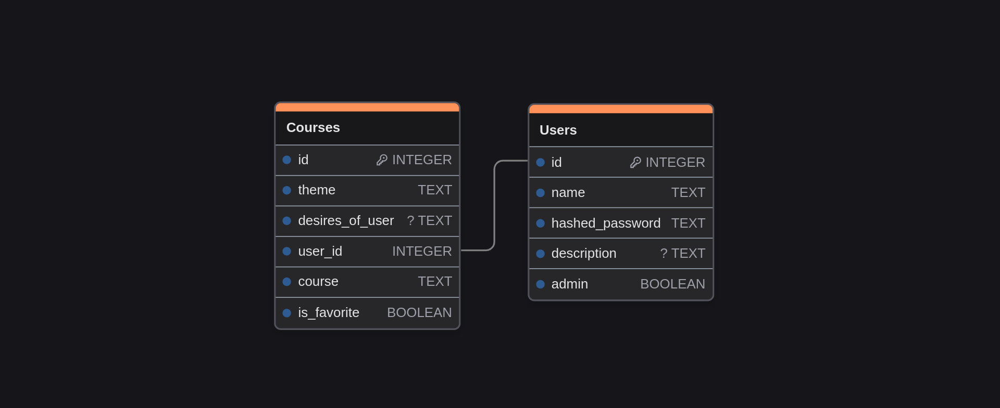

<p align="center">
  <a href="https://sashayerty.github.io/Kairos/"></a>
</p>
<p align="center">
    <em>Kairos - веб-приложение для генерации курсов с помощью ИИ, написанное на flask</em>
</p>
<p align="center">
</p>

[](https://github.com/sashayerty/kairos-fastapi) [](https://flask.palletsprojects.com/en/stable/)  [](https://github.com/Sashayerty/commit_maker)[](https://deepwiki.com/Sashayerty/Kairos)
[](https://github.com/Sashayerty/Kairos/actions/workflows/black.yml)[](https://github.com/Sashayerty/Kairos/actions/workflows/flake8.yml)[](https://github.com/Sashayerty/Kairos/actions/workflows/tests.yml)


Простой проект для создания индивидуального курса/плана обучения с помощью ИИ. [Документация](https://sashayerty.github.io/Kairos/)
<!-- Упор идет на то, что данные будут парситься из СТАТЕЙ. Это прописано в большинстве промптов. -->

## Содержание

1. [Required credentials](#required-credentials)
2. [Пример .env-файла](#пример-env-файла)
3. [Установка](#установка)
    * [pip](#с-помощью-pip)
    * [uv](#с-помощью-uv-рекомендуемое)
4. [API](#api)
5. [Схема логики приложения со стороны агентов](#схема-логики-приложения-со-стороны-агентов)
6. [База данных проекта](#база-данных-проекта)
7. [License](#license)

## Required credentials

#### 1. Google Custom Search API (сделана только функция, без интеграции)

Начнем с поиска данных в интернете. Для работы поиска нам понадобится CSE id и Google Search API Key. [Инструкция](https://developers.google.com/custom-search/v1/overview?hl=ru) по получению. При создании API ключа стоит учитывать, что вы можете указать список сайтов, которые будут парситься при API, что делает поиск более конкретным, узконаправленным и специфичным. Создать поисковый сервис в Google [тут](https://programmablesearchengine.google.com/controlpanel/all).

#### 2. Mistral AI API

Теперь, главная составляющая проекта - ИИ. Получить API ключ можно на официальном [сайте Mistral](https://console.mistral.ai/api-keys/).

## Пример .env-файла

.env-файл должен лежать в корне проекта.

```.env
MISTRAL_AI_API_KEY=mistral-ai-api-key
GOOGLE_API_KEY=google-api-key
CSE_ID=cse-id
SECRET_KEY=secret-key
```

## Установка

### Клонируем

```bash
git clone https://github.com/sashayerty/Kairos --depth 1 # --depth 1 - клонируем последний коммит
cd ./Kairos
```

### С помощью pip

#### 1. Создаем виртуальное окружение python

```bash
#Windows
python -m venv venv
#Linux/MacOS
python3 -m venv venv
```

#### 2. Активируем виртуальное окружение

```bash
#Windows
venv/Scripts/activate
#Linux/MacOS
source venv/bin/activate
```

#### 3. Устанавливаем зависимости проекта

```bash
#Windows
pip install -r ./requirements.txt
#Linux/MacOS
pip3 install -r ./requirements.txt
```

#### 4. Запускаем локальный сервер flask

```bash
#Windows
python run.py
#Linux/MacOS
python3 run.py
```

### С помощью uv (рекомендуемое)

#### 1. Подтягиваем зависимости

```bash
uv sync # .venv создается автоматически
```

#### 2. Запускаем проект

```bash
uv run run.py
```

### Переходим на [http://127.0.0.1:5000/](http://127.0.0.1:5000/)

## API

### [Конфиг](./app/config.py)

Файл конфига. В нем хранятся настройки проекта, которые можно менять и Вам, в зависимости от Ваших нужд.

### [ModifiedMistral](./app/mistral_ai_initializer/mistral_custom_class.py)

Это кастомный класс **Mistral**. Был он создан для того, чтобы убрать лишнюю рутинную работу. Подробнее - [тут](./app/mistral_ai_initializer/mistral_custom_class.py)

### Список агентов

| В схеме | Функция            | Назначение агента                                                       |      Работает      |
| :-----: | ------------------ | ----------------------------------------------------------------------- | :----------------: |
|    1    | check              | Агент для цензуры темы и пожеланий пользователя.                        | :white_check_mark: |
|    2    | gen_prompt         | Агент для создания промпта по теме, пожеланиям и описанию пользователя. | :white_check_mark: |
|    3    | searcher           | Агент для составления поискового запроса по промпту.                    | :white_check_mark: |
|    4    | check_is_need_test | Агент для проверки нужности тестов в курсе.                             |      :bricks:      |
|    5    | gen_plan           | Агент для составления плана курса по промпту.                           | :white_check_mark: |
|    6    | analyze            | Агент для анализа данных из интернета на нужность по плану.             | :white_check_mark: |
|    7    | test               | Агент для создания тестов для курсов.                                   |      :bricks:      |
|    8    | summarizer         | Агент для сжатия статей из интернета.                                   | :white_check_mark: |
|    9    | gen_course         | Агент для генерации итогового результата.                               | :white_check_mark: |
|    *    | edit_course        | Агент для изменения курса по корректировкам пользователя                | :white_check_mark: |
|    *    | create_course      | Агент для итеративной генерации курса.                                  | :white_check_mark: |

`*` - вспомогательный агент

### [google_search](./app/google_custom_search/search_function.py)

Функция для поиска в Google Custom Search. Подробнее [тут](#1-google-custom-search-api-сделана-только-функция-без-интеграции)

## Схема логики приложения со стороны агентов


## База данных проекта



## License

Kairos лицензирован [MIT](./LICENSE)
