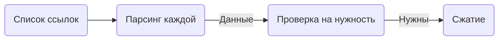

# :sparkles: API проекта

В данном блоке описан весь функционал проекта, написанный мной. От агентов до поиска в Google.

## Агенты

|Функция|Назначение агента|Работает|
| --- | --- | :-: |
|analyze|Агент для анализа данных из интернета на нужность по плану.|:white_check_mark:|
|check|Агент для цензуры темы и пожеланий пользователя.|:white_check_mark:|
|check_is_need_test|Агент для проверки нужности тестов в курсе.|:bricks:|
|gen_course|Агент для генерации итогового результата.|:white_check_mark:|
|edit_course|Агент для изменения курса по корректировкам пользователя|:white_check_mark:|
|create_course|Агент для итеративной генерации курса.|:white_check_mark:|
|gen_plan|Агент для составления плана курса по промпту.|:white_check_mark:|
|gen_prompt|Агент для создания промпта по теме, пожеланиям и описанию пользователя.|:white_check_mark:|
|searcher|Агент для составления поискового запроса по промпту.|:white_check_mark:|
|summarizer|Агент для сжатия статей из интернета.|:white_check_mark:|
|test|Агент для создания тестов для курсов.|:bricks:|

Взаимодействие с агентами реализовано в виде функций. Одна функция - один агент. Для каждого агента прописана документация в соответствующих `.py` файлах. Для того, чтобы импортировать агента из `app.ai_couch` пишем:

```python
from app.ai_couch import {название функции из таблицы}
```

## Web scraper

Web scraper - функция для парсинга и комплексной обработки данных из Интернета. Данные обрабатываются по следующему алгоритму:



Пример использования:

```python
from app.ai_core import gen_plan, gen_prompt
from app.ai_couch import scraper

theme = "LLM в жизни человека"

prompt = gen_prompt(theme=theme)
plan = gen_plan(prompt=prompt)

data = scraper(
    list_of_links=[
        "https://habr.com/ru/articles/775870/",
        "https://habr.com/ru/articles/775842/",
        "https://habr.com/ru/articles/835342/",
        "https://habr.com/ru/articles/768844/",
    ],
    prompt=prompt,
    plan=plan,
)

print(data)

```

## ModifiedMistral

Дочерний класс `Mistral`. Создан для удобства взаимодействия с моделью в рамках приложения. Есть функция `message`, есть инициализатор экземпляра класса. Пример использования:

```python
from app.mistral_ai_initializer import ModifiedMistral, mistral_ai_initializer

instance1 = ModifiedMistral(api_key="api_key")
instance2 = mistral_ai_initializer()  # Автоматически получает API ключ из .env

print(instance1.message(messages=[{"role": "user", "content": "Привет!"}]))
print(instance2.message(messages=[{"role": "user", "content": "Привет!"}]))

> Привет! Как я могу помочь?
> Привет! Как я могу помочь?
```

## Google search

Функция для поиска ссылок с статьями по запросу. Пример использования:

```python
from app.google_custom_search import google_search

print(
    *[
        i["link"]
        for i in google_search(
            "Что такое LLM?",
            api_key="api-key",
            cse_id="cse_id",
            num_results=4,
        )
    ]
)
> https://habr.com/ru/articles/775870/ https://habr.com/ru/articles/775842/ https://habr.com/ru/articles/835342/ https://habr.com/ru/articles/768844/
```
