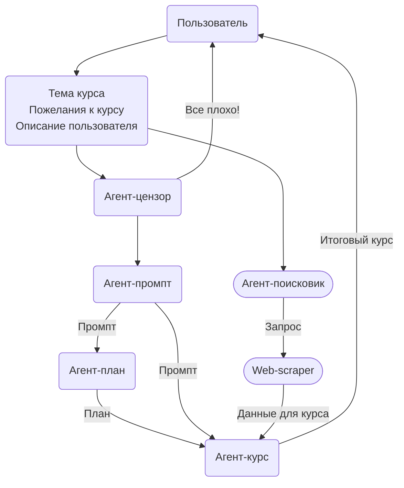

# :tada: Описание

Kairos - веб-приложение, написанное на `flask`. Основной идеей является сокращение времени пользователя на поиск информации и ее дальнейшее структурирование для обучения. Весь функционал, подразумевающий под собой создание промптов, планов, поиск в Интернете и т.п. реализован при помощи ИИ. В проекте используются модели от `Mistral`, в частности модель `mistral-large-latest`. В будущем планируется реализация поддержки локальных моделей `Ollama`.
Сам по себе проект является экосистемой продуктов по брендом `Kairos`. Одним из таких продуктов является `FastAPI` [версия](https://github.com/sashayerty/kairos-fastapi) RestAPI проекта.

ИИ обрабатывает запросы как на русском языке (так изначально задумывалось), так и на английском языке.

Пайплайн взаимодействия ИИ-агентов в проекте (ветка с поиском не работает, но функционал реализован):

## Планы

- Переход от `sqlalchemy` к `SQLModel`
- Поддержка локальных моделей `Ollama`
- Создание отдельного микросервиса для создания и решения тестов `kairos-test`
- Улучшение промптов
- ??? Реализация агентов с помощью `LangChain` ???
- Реализация `rag-системы` с данными из интернета или личной базой знаний
- Включение функции web-скрапинга
- Использование наработок Блума