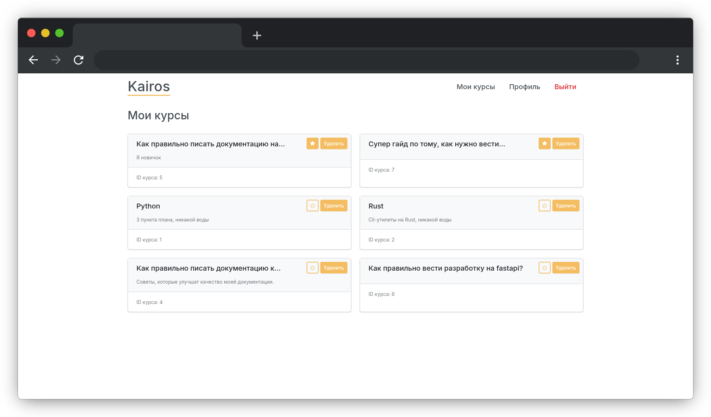

# Примеры UI

UI сделан с использованием Bootstrap.

## 1. Главная страница `/`

## 2. Вход `/login`

## 3. Главная страница (выполнен вход) `/`

## 4. Список курсов `/courses`

## 5. Профиль `/profile`

## 6. Создаем курс `/`

## 7. Созданный курс `/course/{course_id}`

